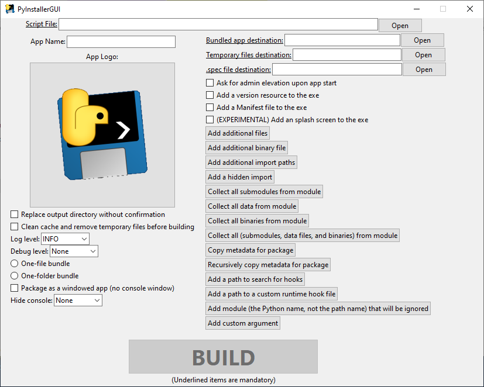
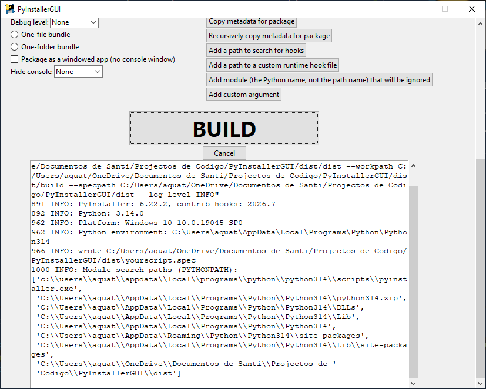

# PyInstallerGUI
An unofficial GUI wrapper for PyInstaller!


Features all the options you need to make a python executable, without needing to delve into the terminal and look up arguments, making it easier to delve into PyInstaller!

# Features
- Autopopulating required fields from script file!
- Opening script files without needing to paste the whole path!
- Dragging scripts into the executable file to open them!
- A fast and unbloated Tkinter-based GUI!
- All the flags you could ever need, and more!
- Auto-opening the distribution folder!

# Screenshots


> [!NOTE]
> These screenshots were taken on Windows 10. Style varies on Windows 11

# Requirements
This program requires:
- [Python](https://python.org) >= 3.13 (Will probably work with other versions, not tested)
- [PyInstaller](https://pyinstaller.org/) >= 6.22.2 (Again, will most likely work on other versions, not tested)

# Downloads
Got your interest? Head to the releases section and grab the [latest one](https://github.com/Aquaticsanti/PyInstallerGUI/releases/latest)!

> [!IMPORTANT]
> This program is only available for Windows 10/11, as I don't have the resources to build for other platforms.

# Building
To build the .exe, use PyInstaller!
```
git clone https://github.com/Aquaticsanti/PyInstallerGUI.git
```
```
cd Pyinstaller
```
```
pyinstaller PyInstallerGUI.spec
```
(You can 100% use the GUI for this, it's what I do, but you are not guaranteed to get the same results, unless you keep the same options)
# Thanks for using PyInstallerGUI!
(Not affiliated with PyInstaller or Python)